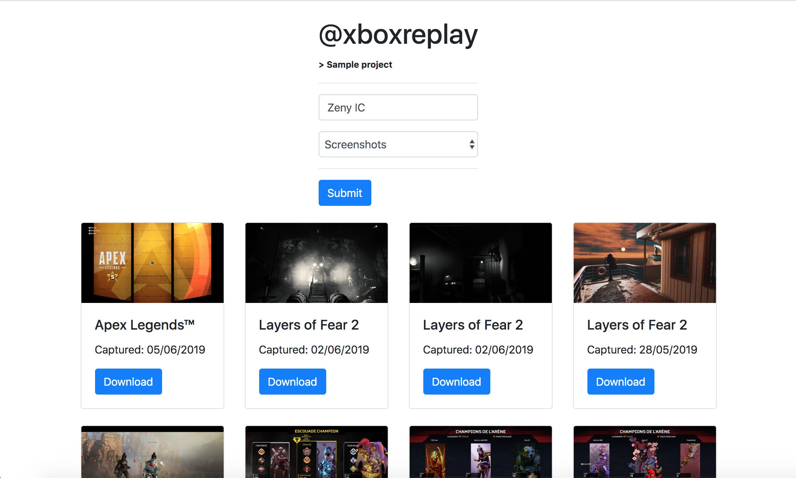

# XboxReplay - Sample Project



### Demo

A live demo is available [here](https://sample-project-demo.xboxreplay.now.sh).

### Installation
```bash
$ git clone https://github.com/XboxReplay/sample-project.git
$ cd sample-project
$ npm install
```

### Start
```bash
$ XBL_EMAIL=user@live.com \
  XBL_PASSWORD=password \
  npm start
```

### Packages
* [@xboxreplay/express-ugc-proxy](https://github.com/XboxReplay/express-ugc-proxy)
* [@xboxreplay/xboxlive-auth](https://github.com/XboxReplay/xboxlive-auth)
* [@xboxreplay/xboxlive-api](https://github.com/XboxReplay/xboxlive-api)

### Deploy it to the cloud with [now](https://zeit.co/now) ([download](https://zeit.co/download))

```bash
now
```
